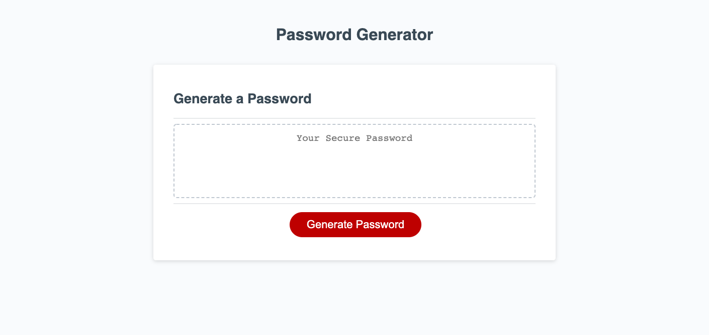

password-generator

Try the random password generator at:
[password-generator](https://valeriehill75.github.io/password-generator/)

This app uses Javascript to store passwords in an array. A pop-up prompt asks the user how many characters they want in the password, as well as if they would like to include numbers, lower case letters, and upper case letters. The user then clicks the submit button to generate a random password.

